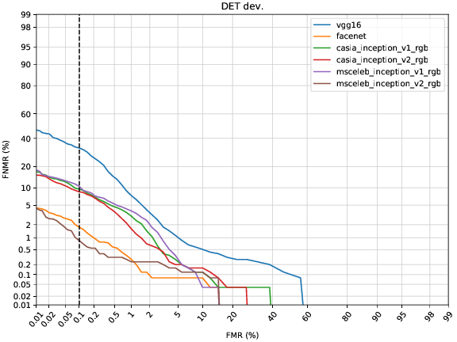
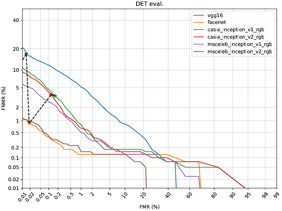

.. vim: set fileencoding=utf-8 :
.. Tiago de Freitas Pereira <tiago.pereira@idiap.ch>

===========
Leaderboard
===========

Next sections presents the leaderboard for each face database and its correspondent evaluation protocols.

Mobio
-----

Testing only the **mobio-male** protocol.

 +-------------------------------+-------------+-------------+
 | System                        | ERR (dev)   | HTER (eval) |
 +===============================+=============+=============+
 | VGG16                         | 2.6%        | 3.1%        |
 +-------------------------------+-------------+-------------+
 | Facenet                       | 0.6%        | 0.2%        |
 +-------------------------------+-------------+-------------+
 | DrGAN                         | 0.8%        | 2.6%        |
 +-------------------------------+-------------+-------------+
 | CasiaNET                      | 16.2%       | 9.9%        | 
 +-------------------------------+-------------+-------------+
 | CNN8                          | 14.8%       | 14.9%       |
 +-------------------------------+-------------+-------------+
 | **Resnetv2 center loss gray** | 2.8%        | 1.8%        |
 +-------------------------------+-------------+-------------+
 | **Resnetv2 center loss RGB**  | 1.2%        | 0.9%        |
 +-------------------------------+-------------+-------------+
 | **Resnetv1 center loss gray** | 2.5%        | 1.3%        |
 +-------------------------------+-------------+-------------+
 | **Resnetv1 center loss RGB**  | 1.7%        | 0.9%        |
 +-------------------------------+-------------+-------------+
 | **ISV**                       | 3.2%        | 7.5%        |
 +-------------------------------+-------------+-------------+

To run each one of these baselines do:

.. code-block:: sh

    $ bob bio baseline vgg16 mobio-male -T <TEMP-DIR> -R <RESULT-DIR>
    $ bob bio baseline facenet mobio-male -T <TEMP-DIR> -R <RESULT-DIR>
    $ bob bio baseline casianet mobio-male -T <TEMP-DIR> -R <RESULT-DIR>
    $ bob bio baseline cnn8 mobio-male -T <TEMP-DIR> -R <RESULT-DIR>
    $ bob bio baseline idiap_casia_inception_v1_centerloss_gray mobio-male -T <TEMP-DIR> -R <RESULT-DIR>
    $ bob bio baseline idiap_casia_inception_v1_centerloss_rgb mobio-male -T <TEMP-DIR> -R <RESULT-DIR>
    $ bob bio baseline idiap_casia_inception_v2_centerloss_gray mobio-male -T <TEMP-DIR> -R <RESULT-DIR>
    $ bob bio baseline idiap_casia_inception_v2_centerloss_rgb mobio-male -T <TEMP-DIR> -R <RESULT-DIR>
    $ bob bio baseline isv mobio-male -T <TEMP-DIR> -R <RESULT-DIR>

Follow below the DET curves for the development and dev sets

LFW
---

Averaging in 10 folds.

  +-----------------------------+-----------------+-----------------+-----------------+
  | System                      | TPIR% (FAR=0.1) | TPIR% (FAR=0.01)|TPIR% (FAR=0.001)|
  +=============================+=================+=================+=================+
  | VGG16                       |                 |                 |                 |
  +-----------------------------+-----------------+-----------------+-----------------+
  | Facenet                     | 99.6  (0.66)    | 98.37 (0.82)    | 0.0   (0.0)     |
  +-----------------------------+-----------------+-----------------+-----------------+
  | Dr GAN                      | 96.6  (1.46 )   | 86.53 (5.13 )   | 0.0   (0.0  )   |
  +-----------------------------+-----------------+-----------------+-----------------+
  | CasiaNET                    |                 |                 |                 |
  +-----------------------------+-----------------+-----------------+-----------------+
  | CNN8                        |                 |                 |                 |
  +-----------------------------+-----------------+-----------------+-----------------+  
  | Resnetv2 center loss gray   | 97.8  (1.36)    | 91.43 (3.37)    | 0.0   (0.0)     |
  +-----------------------------+-----------------+-----------------+-----------------+
  | Resnetv2 center loss rgb    | 97.93 (1.21)    | 91.33 (1.99)    | 0.0   (0.0)     |
  +-----------------------------+-----------------+-----------------+-----------------+
  | Resnetv1 cross  loss gray   |                 |                 |                 |
  +-----------------------------+-----------------+-----------------+-----------------+
  | Resnetv1 cross loss rgb     |                 |                 |                 |
  +-----------------------------+-----------------+-----------------+-----------------+

IJB-A
-----

Verification protocols
**********************

Follow bellow the results using CMC (Cumulative Matching Curve) and TPIR (True Positive Identification Rate)
under different values of FAR (False Alarm Rate).

  +-----------------------------+-----------------+-----------------+-----------------+-----------------+
  | System                      |        RR       | TPIR% (FAR=0.1) | TPIR% (FAR=0.01)|TPIR% (FAR=0.001)|
  +=============================+=================+=================+=================+=================+
  | VGG16                       | 96.17 (0.66 )   |  88.23 (1.12)   |  58.36 (3.6)    | 31.55 (4.31)    |
  +-----------------------------+-----------------+-----------------+-----------------+-----------------+
  | Facenet                     | 94.43 (0.57)    | 92.59 (1.05)    | 67.94 (2.87)    | 40.89 (6.45)    |
  +-----------------------------+-----------------+-----------------+-----------------+-----------------+
  | Dr GAN                      | 91.61 (0.81 )   | 82.28 (1.76)    | 45.05 (3.39)    | 21.68 (4.1)     |
  +-----------------------------+-----------------+-----------------+-----------------+-----------------+
  | CasiaNET                    |                 |                 |                 |                 |
  +-----------------------------+-----------------+-----------------+-----------------+-----------------+
  | CNN8                        |                 |                 |                 |                 |
  +-----------------------------+-----------------+-----------------+-----------------+-----------------+  
  | Resnetv2 center loss gray   | 90.76 (1.3)     | 82.23 (2.24)    | 46.33 (3.01)    | 23.59 (3.22)    |
  +-----------------------------+-----------------+-----------------+-----------------+-----------------+
  | Resnetv2 center loss rgb    | 92.12 (1.48)    | 81.03 (1.86)    | 47.48 (2.46)    | 24.97 (4.3)     |
  +-----------------------------+-----------------+-----------------+-----------------+-----------------+
  | Resnetv1 cross  loss gray   |                 |                 |                 |                 |
  +-----------------------------+-----------------+-----------------+-----------------+-----------------+
  | Resnetv1 cross loss rgb     |                 |                 |                 |                 |
  +-----------------------------+-----------------+-----------------+-----------------+-----------------+

IJB-C
-----

Verification protocol 1:1
*************************

This section presents the results for verification (1:1) protocol.
Check `here <https://www.idiap.ch/software/bob/docs/bob/bob.db.ijbc/stable/index.html>`_ for more details.

+-----------------------------+-----------------+-----------------+-----------------+
| System                      | TPIR% (FAR=0.1) | TPIR% (FAR=0.01)|TPIR% (FAR=0.001)|
+=============================+=================+=================+=================+
|                             |                 |                 |                 |
+-----------------------------+-----------------+-----------------+-----------------+
| Facenet                     | 97.137          | 85.944          | 64.979          |
+-----------------------------+-----------------+-----------------+-----------------+
| Dr GAN                      | 90.397          | 62.152          | 31.912          |
+-----------------------------+-----------------+-----------------+-----------------+
| CasiaNET                    |                 |                 |                 |
+-----------------------------+-----------------+-----------------+-----------------+
| CNN8                        |                 |                 |                 |
+-----------------------------+-----------------+-----------------+-----------------+
| Resnetv2 center loss gray   | 90.806          | 66.754          | 39.577          |
+-----------------------------+-----------------+-----------------+-----------------+
| Resnetv2 center loss rgb    | 90.633          | 67.388          |41.837           |
+-----------------------------+-----------------+-----------------+-----------------+
| Resnetv1 center loss gray   | 90.597          | 67.945          |41.402           |
+-----------------------------+-----------------+-----------------+-----------------+
| Resnetv2 center loss rgb    | 90.985          | 68.4            |42.041           |
+-----------------------------+-----------------+-----------------+-----------------+

